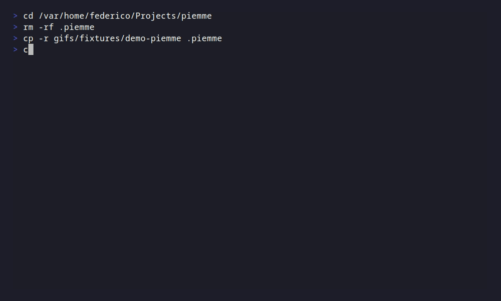
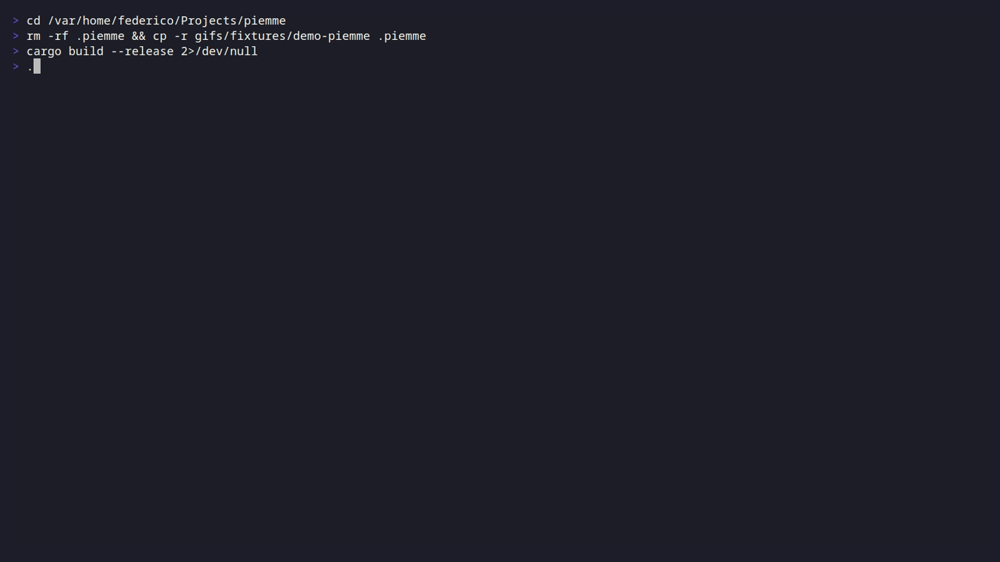

# piemme

Every project has its quirks. Every AI workflow needs its own prompts. Stop copying prompts between chat windows—**store them alongside your code**, version control them with git, and build complex prompt chains with a single keystroke.

Piemme is a blazingly fast TUI prompt manager built in Rust. Your prompts live as simple Markdown files in a `.piemme/` folder—future-proof, portable, and yours forever. No cloud, no lock-in, no nonsense.

## Why Piemme?

- **Project-local prompts**: Each project gets its own `.piemme/` folder. Your prompts live with your code and travel with it.
- **Version control friendly**: Plain Markdown files with YAML frontmatter. `git diff` your prompts, review them in PRs, branch them.
- **References**: Build complex, hierarchical prompts with `[[other_prompt]]` syntax. Compose, reuse, stay DRY.
- **File References**: Include local file content with `[[file:path/to/file]]`. Provide code context without copy-pasting.
- **Dynamic commands**: Embed shell output with `{{ls -la}}` or `{{git status}}`—your prompts adapt to your context.
- **Vim-native**: Modal editing, `hjkl` navigation, operators (`d`, `c`, `y`), motions—if you know Vim, you're home.
- **Fast & reliable**: Rust-powered, instant startup, no runtime dependencies.
- **100% local**: Everything stays on your machine. No accounts, no telemetry, no surprises.

## Demo

| Navigation & UI |
|:---:|
|  |

| Create & Edit |
|:---:|
|  |

| References |
|:---:|
|  |

| Commands |
|:---:|
|  |

| Tags & Filtering |
|:---:|
|  |

| Folders & Archive |
|:---:|
|  |

| Search & Actions |
|:---:|
|  |

## Installation

### Quick Install (Linux/macOS)

```bash
curl -fsSL https://raw.githubusercontent.com/cartesia-one/piemme/main/install.sh | bash
```

### Download Binary

Grab the latest release from [Releases](https://github.com/cartesia-one/piemme/releases):

| Platform | Binary |
|----------|--------|
| Linux x86_64 | `piemme-linux-x86_64` |
| Linux ARM64 | `piemme-linux-aarch64` |
| macOS Intel | `piemme-macos-x86_64` |
| macOS Apple Silicon | `piemme-macos-aarch64` |
| Windows x86_64 | `piemme-windows-x86_64.exe` |

```bash
chmod +x piemme-* && mv piemme-* ~/.local/bin/piemme
```

### From Source

```bash
git clone https://github.com/cartesia-one/piemme.git
cd piemme && cargo build --release
# Binary at target/release/piemme
```

### Cargo Install

```bash
cargo install --git https://github.com/cartesia-one/piemme.git
```

## Quick Start

```bash
cd your-project
piemme  # Creates .piemme/ folder automatically
```

Press `n` to create your first prompt. Start typing. Press `Esc` to save and return to the list. Press `y` to copy the rendered prompt to your clipboard. Paste it into your AI chat.

## Keybindings

### Navigation

| Key | Action |
|-----|--------|
| `j` / `k` | Move down / up |
| `g` / `G` | Jump to first / last |
| `/` | Fuzzy search |
| `Ctrl+p` | Quick open |

### Prompts

| Key | Action |
|-----|--------|
| `Enter` / `i` | Edit prompt |
| `n` | New prompt |
| `r` | Rename |
| `d` | Delete |
| `Ctrl+d` | Duplicate |
| `y` | Copy rendered to clipboard |
| `p` | Preview resolved content |

### Organization

| Key | Action |
|-----|--------|
| `t` | Manage tags |
| `[` / `]` | Cycle tag filter |
| `O` | Open folder |
| `M` | Move to folder |
| `a` / `A` | Archive / View archive |

### Editor (Vim-style)

| Key | Action |
|-----|--------|
| `i` / `a` / `o` | Insert / Append / Open line |
| `Esc` | Save & exit (from Normal) |
| `dd` / `cc` / `yy` | Delete / Change / Yank line |
| `dw` / `cw` / `yw` | Delete / Change / Yank word |
| `u` / `Ctrl+r` | Undo / Redo |
| `Ctrl+r` | Insert reference `[[...]]` |
| `Ctrl+f` | Insert file reference `[[file:...]]` |
| `v` / `V` | Visual / Visual Line mode |

Press `?` anytime for full keybinding help.

## Configuration

Edit `.piemme/config.yaml`:

```yaml
safe_mode: true  # Confirm before running {{commands}}
tag_colors:
  coding: blue
  writing: green
  work: yellow
```

## License

MIT
